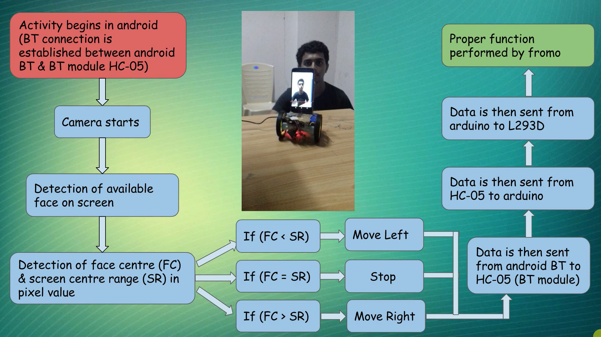
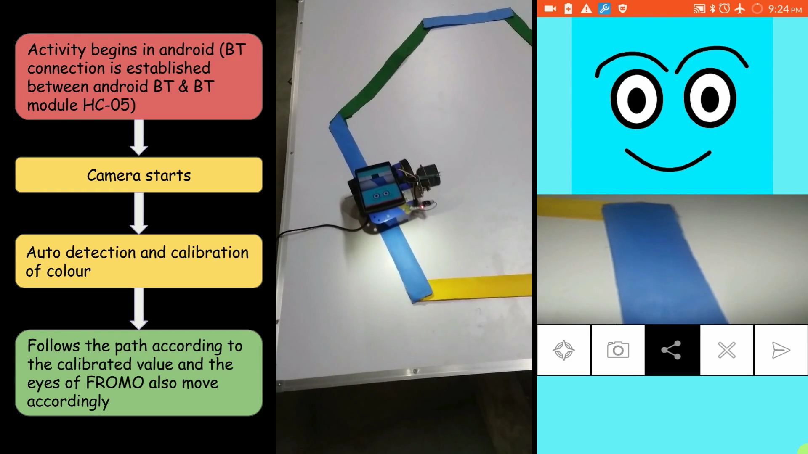
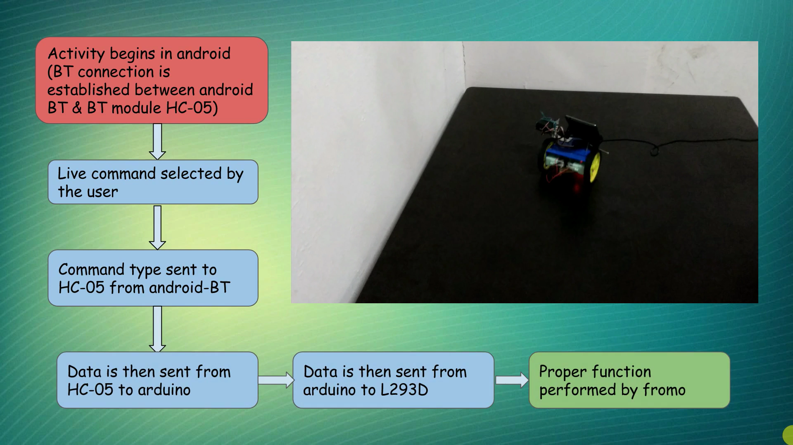
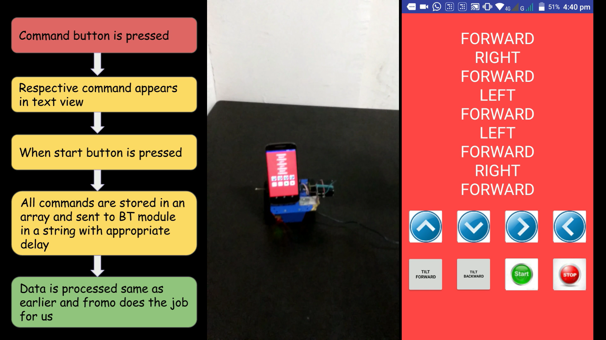

# FROMO
FROMO - Friendly Robot Mobile - Android Robotics

Android in today's world is a widely accepted operating system which is accessible, affordable and available across maximum part of the globe.

FROMO(Friendly Robot Mobile) is capable of performing tasks like remote controlled movement, face following mechanism (follows your face wherever you go!), programming mechanism (you can basically program the robot’s moves in a predefined way!), colored line following mechanism (the robot can follow colored lines!).

For demo, please watch this YouTube video - https://www.youtube.com/watch?v=inJWdqrtSh4

## Flowchart of project

## Goals Accomplished

### 1. Face Following

1. The app has camera preview feature in it.
2. We use frame layout to design the XML code such that the whole screen previews the camera.
3. We use the face detection code to detect the face on the screen.
4. The center of the face as well as the center of the screen are evaluated.
5. If the center of the face is determined to be left of the screen center, then the bot is instructed to move left and similar for right.

### 2. Multi-Color Path Following

1. The screen is divided into five parts . The average pixel brightness of each part is calculated and stored in an array of size five. The part with largest and shortest average value is found out and named say lar and sma. Their average is found out and named say divisor.
2. The five option buttons are placed just below the five parts . Each button’s background is set white if it’s average pixel value is greater than divisor and black if it’s less than divisor.
3. Accordingly, as the painted strip is darker it reduces the average value of the pixel block it is present in. Hence the button below the block turns black. the robot is then commanded to turn right or left depending on whether the button with darker background is present on left or right.

### 3. Remote Controlled Movement

1. Screen consists of the image buttons of the respective directions.
2. In this app Bluetooth is interfaced.
3. On clicking any button of the app activity, data is send corresponding to that button to Arduino Uno which is interfaced via Bluetooth module HC05.
4. Corresponding to the data sent, the Arduino instructs the motor driver L293D to turn to the specified direction.

### 4. Programmed Movement

1. The app which consists of the image buttons of the respective directions along with an additional button to start the execution when the user is finished with planning the path.
2. Similar to Remote control mode, each button sends a corresponding data but instead of sending it directly to Arduino Uno via Bluetooth module HC05, it stores the data in an array in the specific order of the input.
3. On clicking the start button, the values of the array are sent to Arduino in the specified order with a given delay.
4. The Arduino executes the given data by sending the corresponding instructions to the motor driver L293D.

## Applications
1. Robots can be configured to do repetitive tasks using android.
2. The size of the robot being a small one, it can be used for surveillance purpose.
3. In the times of natural disasters like earthquakes, the bot can go to the places unreachable and provide us with necessary information if properly programmed or with the help of it’s secondary camera.
4. They can be made to follow particular color based path to reach a particular destination.
6. The programming mode can be used to solve various mazes by the bots using android.
7. With the help of face following mechanism, one can bring his robot with him without any effort.

## Challenges
1. The major challenge is the accommodation of battery and attachment of the android phone with the base within the desired boundaries of the design.
2. The design of the robot is very crucial aspect for it’s efficient working.

## Additional Notes
1. We completed this project during summer 2017.
2. For demo, please watch this YouTube video - https://www.youtube.com/watch?v=inJWdqrtSh4
