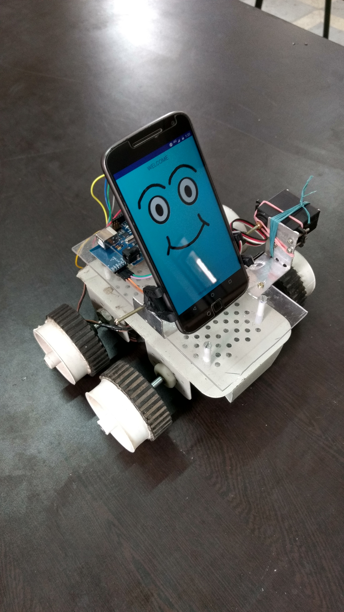
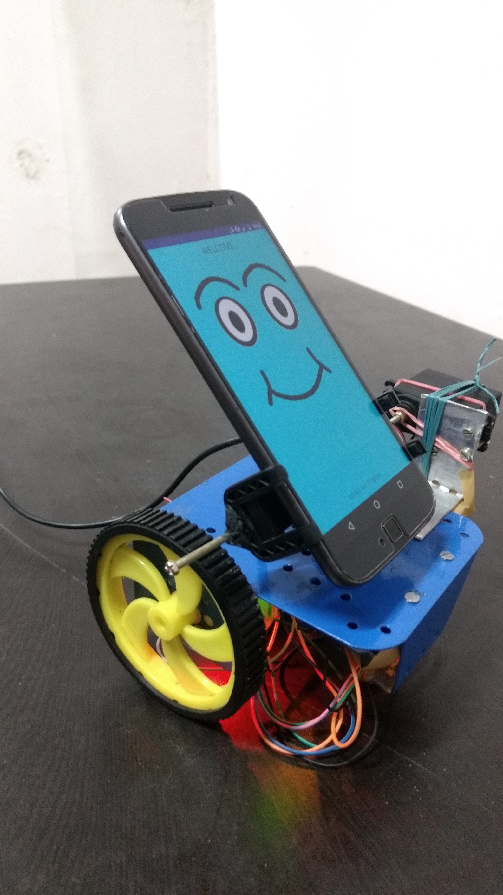
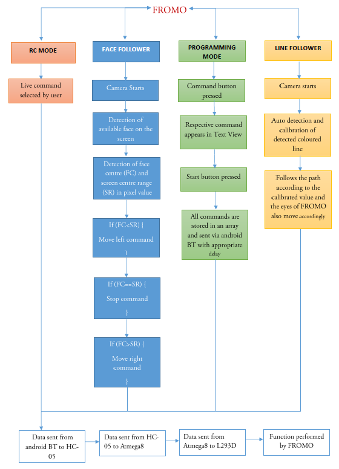

# fromo
FROMO - Friendly Robot Mobile

Android in today's world is a widely accepted operating system which is accessible, affordable and available across maximum part of the globe.

FROMO(Friendly Robot Mobile) is capable of performing tasks like remote controlled movement, face following mechanism (follows your face wherever you go!), programming mechanism (you can basically programme the robot’s moves in a predefined way!), colored line following mechanism (the robot can follow colored lines!).

## Flowchart of project

## Important Instructions
Before cloning this repository, make sure to do the following:

